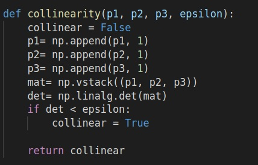
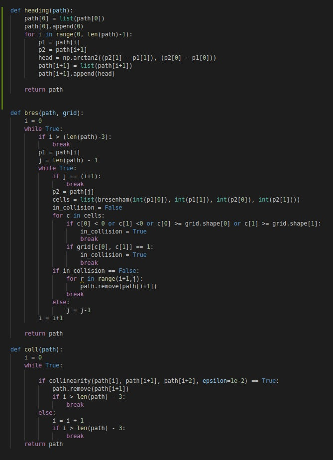

## Project: 3D Motion Planning

---

# Required Steps for a Passing Submission:
1. Load the 2.5D map in the colliders.csv file describing the environment.
2. Discretize the environment into a grid or graph representation.
3. Define the start and goal locations.
4. Perform a search using A* or other search algorithm.
5. Use a collinearity test or ray tracing method (like Bresenham) to remove unnecessary waypoints.
6. Return waypoints in local ECEF coordinates (format for `self.all_waypoints` is [N, E, altitude, heading], where the drone’s start location corresponds to [0, 0, 0, 0].
7. Write it up.
8. Congratulations!  Your Done!

## [Rubric](https://review.udacity.com/#!/rubrics/1534/view) Points
### Here I will consider the rubric points individually and describe how I addressed each point in my implementation.  

---
### Writeup / README

#### 1. Provide a Writeup / README that includes all the rubric points and how you addressed each one.  You can submit your writeup as markdown or pdf.  

You're reading it! Below I describe how I addressed each rubric point and where in my code each point is handled.

### Explain the Starter Code

#### 1. Explain the functionality of what's provided in `motion_planning.py` and `planning_utils.py`

The main file to run the autonomous mode is motion_planning.py while the planning_utils.py file provides the helper codes. 

In motion_planning.py, the default functions to run the drone describes the common transition that the drone will perform in autonomous mode. In the 'planning' state, the drone will perform the new functions which I added.

First, I parse the csv data to map them into grid using the function 'create_grid'. The objective of my implementation is to enable any coordinates to be set as goal coordinates. Once the start and goal coordiantes are determined, I run a path searching algorithm called 'a_star' to find the optimal path in the grid. Euclidean distance is used to check for distance between the drone's current position and the goal position.  

### Implementing Your Path Planning Algorithm

#### 1. Set your global home position
Here I read the first line of the csv file using python's readline module and extract lat0 and lon0 as floating point values using regular expression.

#### 2. Set your current local position
Here, I retrieved the global_position as a numpy array and converted them to current local position using global_to_local() function.

#### 3. Set grid start position from local position
The start position is modified to the current position.

#### 4. Set grid goal position from geodetic coords
The grid goal position can be any position on the grid based on user input.Next,I run some checks to check if this position is not on top of a building or on the ground. If the goal position does not collide with any obstacle polygon, the drones altitude is set to 5 meters. If it does collide with a building, the drone altitude is set to 5 metres plus the building height. 

#### 5. Modify A* to include diagonal motion (or replace A* altogether)
Here, modified the A* implementation provided in the planning_utils.py to include diagonal motion by creating conditions for actions Action.NW, Action.NE, Action.SW, Action.SE. This is shown below:

#### 6. Cull waypoints 
The path is pruned using collinearity test to check for collinearity of the points in the path, bresenham function and finally the waypoints headings are calculated.
The idea is simply to prune the path of unnecessary waypoints.

### Execute the flight
#### 1. Does it work?
It works!

### Double check that you've met specifications for each of the [rubric](https://review.udacity.com/#!/rubrics/1534/view) points.
  
# Extra Challenges: Real World Planning

For an extra challenge, consider implementing some of the techniques described in the "Real World Planning" lesson. You could try implementing a vehicle model to take dynamic constraints into account, or implement a replanning method to invoke if you get off course or encounter unexpected obstacles.

